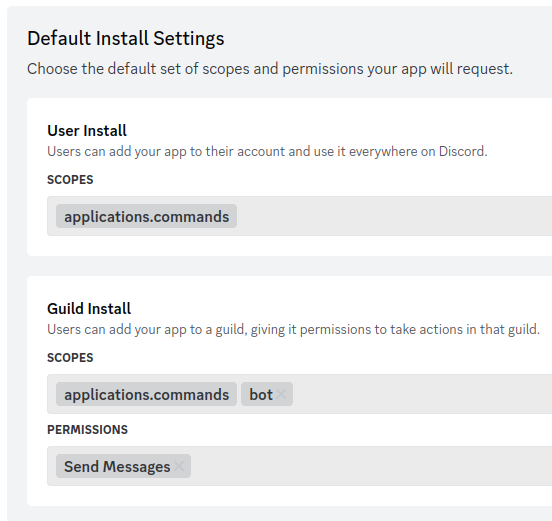
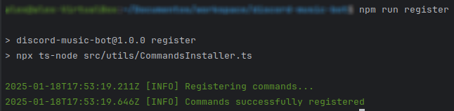
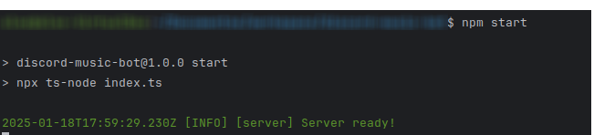
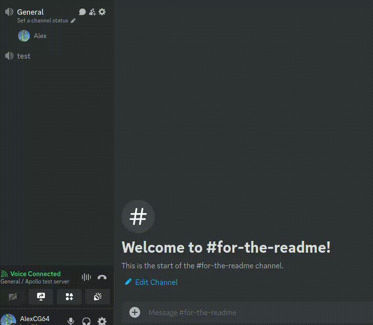

# 🎵🎹 Apollo: A backend for your Discord music bot
Welcome to Apollo! This repository contains a backend ready to use with discord, so you can create custom
music bots!

## Why Apollo 🤔?
> _[Apollo](https://en.wikipedia.org/wiki/Apollo) is one of the Olympian deities in ancient Greek and Roman religion and Greek and Roman mythology. Apollo has 
> been recognized as a god of archery, music and dance, truth and prophecy, healing and diseases, the Sun and light, poetry, and more..._

## Contents 🗒️
1. [Local installation](#local-installation-)
2. [Run](#run-in-local-)
3. [Functionalities](#functionalities-)
4. [Contribution](#contribution-)

### Local installation 💾
As every node project, you must have `node.js` (>= 22.13) and `npm` (>= 10.9) installed in your local machine.

**Note**: This library makes usage of the library [`discord.js`](https://discord.js.org/), so as long as this library is maintained,
the bot backend will be operative.

First, you need to download the project, as you may assume is as easy as:
```
git clone https://github.com/AlexCabezas2018/discord-music-bot
```

Next, you need to install the dependencies:
```
cd discord-music-bot
npm install
```

And that's all, the project will be ready to move to the next point!

## Run in local 🚀
You need to be aware that this project is not a bot by itself, it's a backend that
contains all the needed functionalities to make **YOUR BOT** to work. This might be confusing, but this doesn't
provide any bot, so you will have to create it first and then link it to this repo.

You can check a bot that is currently using this backend! [Here](https://discord.com/oauth2/authorize?client_id=1327356658774577202)

1. Create a bot. For that, you can follow [this link](https://discord.com/developers/applications?new_application=true)  
 **IMPORTANT**: Don't forget to give to your bot the following scopes and permissions (and a cool name of course 😎):



If you followed correctly the procedure, you must have somewhere stored an `APP_ID`, `BOT_TOKEN` and `PUBLIC_KEY` variables.
I don't think I have to tell you, but those are sensitive data, so I don't recommend sharing this anywhere, otherwise your
bot security could be compromised.
2. In this project, there is a file called [`.env.example`](.env.example). To run it in local, you will need to rename the file to just
`.env` and replace the placeholder with the values that you got (This information will be shared just with Discord API, so no security leaks here).
3. You will have to register the commands that are available in the [`commands.json`](priv/commands.json) file. For that, you will need to run:
```
npm run register
```



4. Just run `npm start` and your back will start to listen to your bot events! (Please, invite your factory new Bot to any server
please, he wants to participate 😂)




Here are other util commands that can be invoked via `npm`:

- `npm test`: executes the test suite (it uses Jest)
- `npm run format`: It formats the code using the library `tsfmt`
- `npm run format-verify`: It checks if the code is correctly formatted (Remember this command for later)

## Functionalities 🕺🎵
1. `/play [url]`: Reproduces a song given a correct YouTube URL


2. `/stop`: It stops the music.


## Contribution 🫶
Want to improve this? Great news! I'm open to any change that can improve this, but I have some rules:
1. Of course, you can fork it, but if you think that you have an idea, and you want to contribute here, just open an issue,
I will be very happy to take a look and discuss potential solutions!
2. Please, if you want to go with a PR, **always link it to an issue**, don't create a PR only! The community won't have the proper
context.
3. Please, in the issue **expose what you want to do, or the problem** if you want to share a bug. Give us as much context as possible, so [x/y problems](https://xyproblem.info/)
are avoided.
4. **The PR must be success before assigning any reviewer**. Pipeline is very simple. Watch out the format step, as it will fail if you didn't
format your code (remember `npm run format`?)
5. **PR must be approved by at least one reviewer**, and potential discussions must be resolved.